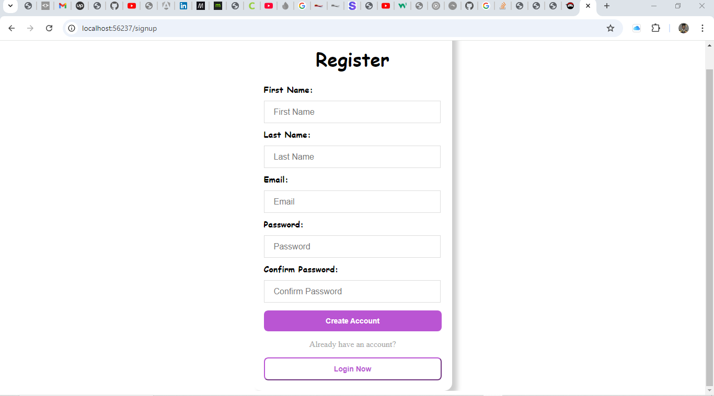
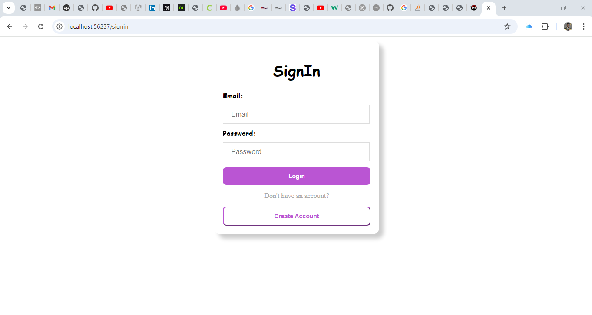
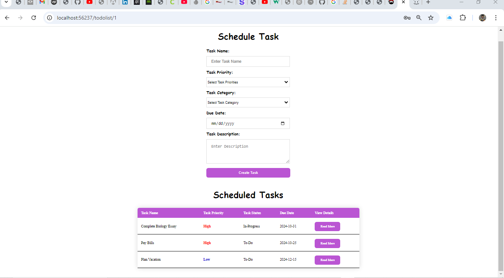
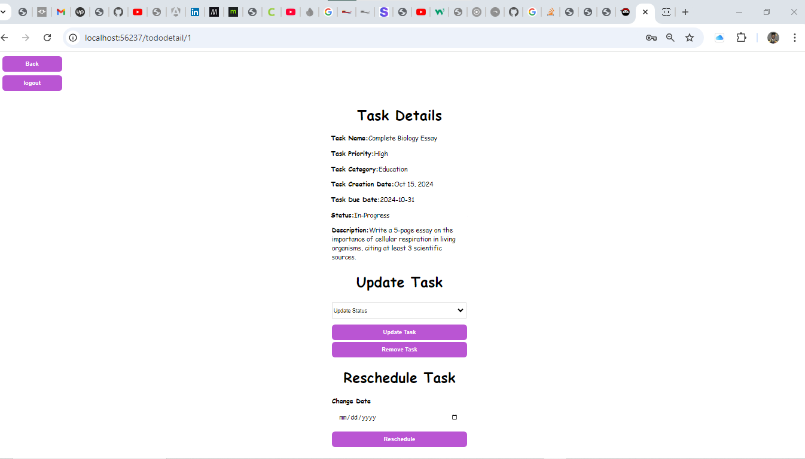

## Table of Content

- [introduction](#introduction)
- [Features](#features)
- [Technoligies and Software Tools](#technologies-and-software-tools)
- [Getting Started](#getting-started)
- [Usage](usage)
- [Testing](testing)
- [Screenshot](screenshot)
- [Live Demo](live-demo)
- [Author](author)

## Introduction

Welcome to my todo list app. A simple, yet powerful task management tool built using angular 18.  

## Features

* Login functionality.
* Create user account functionality
* Create and manage unlimited todo lists.
* Priotize tasks and customizable labels and due dates.

## Technologies and Software Tools

1. Front-End - HTML5, CSS and Typescript
2. Back-End - TypeScript 
3. Database - Json Server -> Json File 
4. Software tools - Visual Studio Code and GitHub.

## Getting Started

1. Clone the repository: git clone https://github.com/Mncedisi95/assessment-two
2. Install dependencies: npm install.
3. Start the development server: npm start.
4. Build and Deploy: npm run build and npm run deploy.
5. Switch to a specific branch: git checkout master
6. Pull changes from remote repository: git pull master
7. Run tests for the project: npm run test.
8. Run linter checks for code quality: npm run link.
9. Generate documentation for the project: npm run docs.

## Usage

* Sign up for a free account.
* Create your first todo list.
* Start adding, updating, removing tasks and getting organized.

## Screenshot

## Live Demo

This Todo website is live at 

## Testing

1. Created two user account.
2. Scheduled tasks on each user and updated status.
3. Feel free to create your account and schedule tasks.

## Author

* Name: Mncedisi Masondo
* Email: mncedisimasondo4@gmail.com
* Linkedin Profile: https://www.linkedin.com/in/mncedisi-masondo-9791b2189/ 
